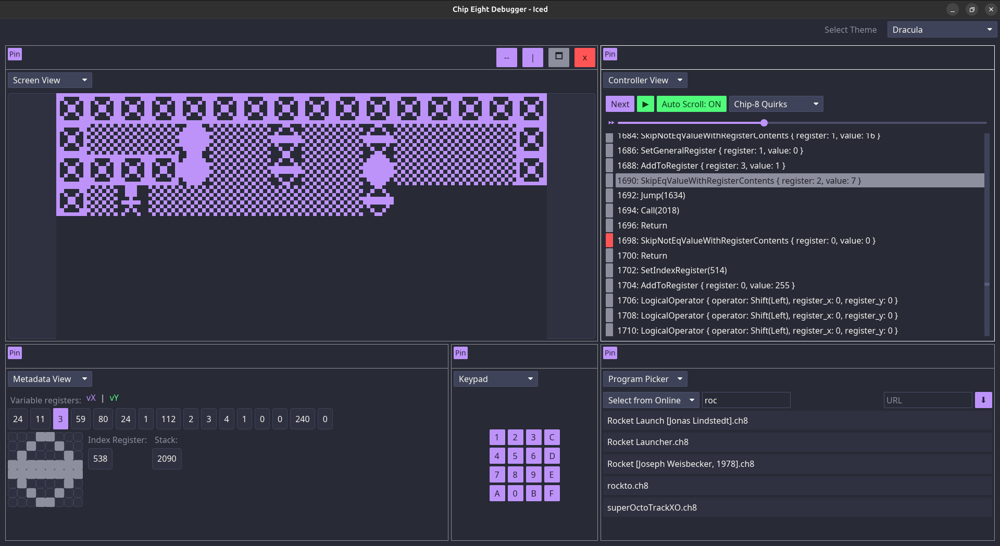

# Chip Eight Debugger

This is an implementation using the chip 8 interpreter library [here](https://github.com/GerhardusC/chip-8-rs) to test out its interface and usage (mostly for me to see how to write usable libraries).

The idea behind this project that is also want to make something like what is mentioned in [this article](https://tobiasvl.github.io/blog/write-a-chip-8-emulator/#timers) available [here](https://twitter.com/kraptor/status/1153936421209509888) (Mine I don't think is nearly as useful (yet?)).

## Running the debugger

Ensure you have the rust toolchain installed and run `cargo run --release`.

## Usage

This debugger allows you to have panes that represent different parts of the interpreter (this idea I found [here](https://github.com/iced-rs/iced/tree/master/examples/pane_grid)). There are currently 5 supported pane types / views that are described below.

### Program Picker View

This view lets you select a program, either online or from disk.

#### Selecting from Online

Search the searchbar and click on a program that you want to run. Note that not all of them will work, some of them are for the XO-chip, which is not supported here.

The games were taken directly from [Timendus/chip8-test-suite](https://github.com/Timendus/chip8-test-suite), [kripod/chip8-roms](https://github.com/kripod/chip8-roms) and [JohnEarnest/chip8Archive](https://github.com/JohnEarnest/chip8Archive). See `update_games.sh` for details. 
If the game you are looking for does not appear in the list, but is available online, you may also use the `URL` searchbox to try retrieve it directly online.
The `games.txt` file is used to set the urls of all available games at startup.

#### Selecting from Disk

You may also just select a file from disk with this option. The file picker will start up where the program was launched from. The input box allows you to change directories or set the absolute path of a file to use.

### Controller View

In the controller view, you can use `next` to step to the next instruction.

You can press `spacebar` or click the `play` button to continuously execute instructions.* 

You can speed up and slow down execution with the slider at the top.

The Auto Scroll button just allows the instructions container scrolling to follow execution. There is a toggle, because when the program is running it keeps making the scroll jump around (of course), making it impossible to set breakpoints while the program is running.

You may change the quirks behaviour with the quirks dropdown, note that this again does not include anything involving display rate.

You can set a breakpoint by clicking next to instructions (apologies for my terrible names for the instructions). 

Finally, you can use the slider to change the rate at which instructions are executed.

*Note: technically it is not "running the program" because the debugger does not respect anything about drawing timings, if timing is a concern, you should probably be using a proper interpreter, not just a debugger, a timing aware implementation can be found in the examples of this repository [here](https://github.com/GerhardusC/chip-8-rs) (I think it is accurate at least). Y

### Keypad View

You may use the keypad in 2 ways, either by clicking the actual buttons on the on screen keypad, which will toggle the key, or you can use the keys `1,2,3,4,q,w,e,r,a,s,d,f,z,x,c,v` that are mapped to these buttons (the keypad does not need to be open for keystrokes to be registered).

### Metadata View

At the top it shows the current values of the variable registers 0x0-0xF, highlighting them if instructions are pointing to them.

Below this it shows the index register and the current location in memory that the index register is pointing to (the height of this block is updated each time the draw instruction is called).

Finally you can see the stack next to the index register.

### Screen View

Shows stuff, pretty obvious really.

